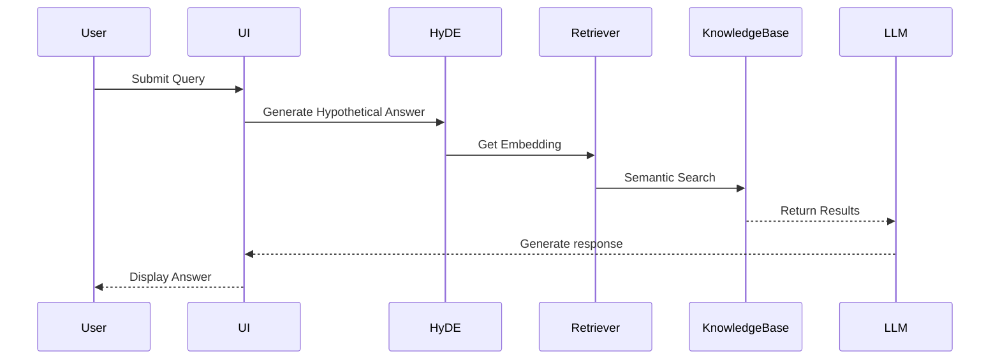

# Formula Student Rules Assistant - FSG Quiz Helper

An AI-powered system for querying Formula Student competition rules using HyDE (Hypothetical Document Embeddings) and RAPTOR-inspired clustering, featuring automatic expansion of 100+ technical abbreviations.

## 📋 Prerequisites
- **Python 3.12+**
- **Google AI Studio API key** ([Get here](https://aistudio.google.com/apikey))
- **Ollama** ([Install guide](https://ollama.ai/)) with `nomic-embed-text` model

## 🚀 Quick Start (Recommended Setup)
```bash
# 1. Create and activate virtual environment
python -m venv venv
source venv/bin/activate  # Linux/Mac
.\venv\Scripts\activate  # Windows

# 2. Install dependencies
pip install -r requirements.txt

# 3. Configure environment
cp .env-example .env
# Edit .env with your API key

# 4. Launch Ollama (in separate terminal)
ollama pull nomic-embed-text
ollama serve

# 5. Run the application
python ./src/main.py
```

## 🛠️ Usage
Access the interface at `http://localhost:7860` after launching.

**Example Queries:**
- "What is the Tractive System max voltage?"
- "What is the minimum ground clearance?"

The checkbox labeled **"Generate Answer"** controls two response modes:

1. **☑ Checked (Generate Mode)**:  
   - System creates a concise, quiz-style answer  
   - Ideal for: Quick studying, direct test preparation  
   - Example Output:  
     *"The TSAL must be red when the tractive system is active (EV5.7.3)"*

2. **☐ Unchecked (Reference Mode)**:  
   - Shows raw rulebook excerpts with highlights  
   - Ideal for: Deep verification, understanding context  
   - Example Output:  
     *"EV5.7.3 - The Tractive System Active Light shall illuminate red when..."*

## 📁 Project Structure
```
.
├── .env-example          # Environment template
├── .gitignore           # Git exclusion rules
├── requirements.txt     # Python dependencies
└── src/
    ├── data/            # Rulebook PDFs and processed data
    ├── HyDE.py          # Hypothetical answer generator
    ├── ingest.py        # Rulebook processing pipeline
    ├── main.py          # Web interface
    ├── retrieve.py      # Semantic search system
    └── pure_raptor.ipynb # Advanced clustering R&D
```

## 💻 Code Components

### `src/HyDE.py`
Generates hypothetical rule embeddings using Google's Gemini to improve search accuracy. Creates AI-generated "what a rule might look like" embeddings for better semantic matching.

### `src/ingest.py`
Processes raw rulebook PDFs into structured data:
- Text extraction and cleaning
- Abbreviation expansion
- Hierarchical tree construction
- Embedding generation

### `src/retrieve.py`
Implements the search system:
- Cosine similarity calculations
- Multi-level hierarchical search
- Top-k result ranking

### `src/main.py`
Web interface built with Gradio that:
- Handles user queries
- Coordinates HyDE generation and retrieval
- Displays results (raw context or generated answers)

### `src/pure_raptor.ipynb`
Experimental RAPTOR implementation featuring:
- UMAP dimensionality reduction
- Gaussian Mixture clustering
- Recursive tree construction


## 📊 System Architecture


## 📜 License
MIT License - See [LICENSE](LICENSE) for details.

---

*Note: The Ollama service must remain running (`ollama serve`) during application use.*

